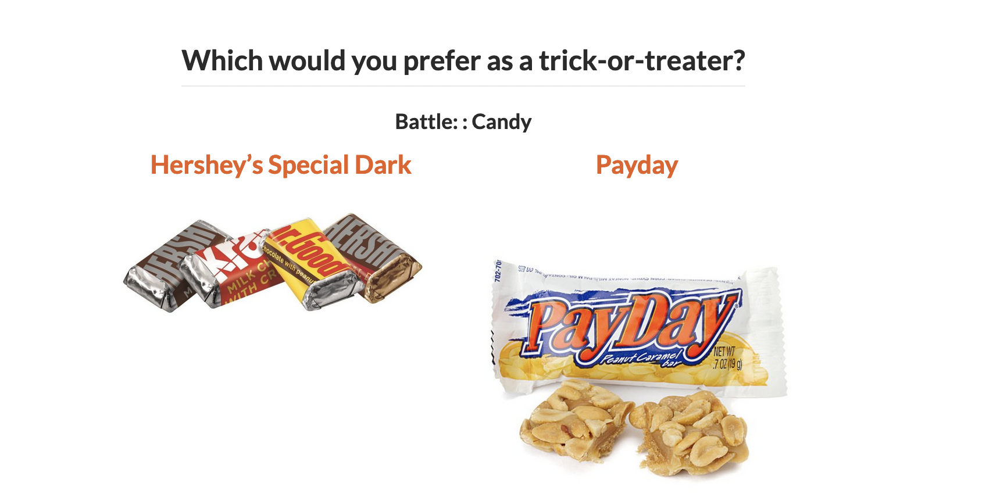

# Questions Round-Up


# As we wrap up...

* I'd recommend downloading `R` and RStudio to your personal computer.  You can find directions [here](https://posit.co/download/rstudio-desktop/).
* Make sure to export all your materials from Posit Cloud in the next week or so.  I will delete the materials on June 30th.
* Attend the weekly **Writing/Coding Sessions**: 2:00 - 4:00pm on Mondays in June & July, Taylor Hall 203.

# Models/Tests we are going to cover:

* For modeling a quantitative variable:
    + When you have a single categorical explanatory variable (with two categories): Two sample t-test
    + When you have 1 or more explanatory variables (categorical and/or quantitative): Linear regression
    
* For modeling a categorical variable:
    + When you have a single categorical explanatory variable: Chi-squared test
    + When you have 1 or more explanatory variables (categorical and/or quantitative): Logistic regression and classification trees

For the sake of time today, not going to focus on model assumptions, but make sure to check them!


# Load Packages

```{r}
# For data wrangling and plotting
library(tidyverse)

# For fitting classification trees
library(rpart)

# For creating charts of trees
library(rpart.plot)
```


# Data Example:

> "The social contract of Halloween is simple: Provide adequate treats to costumed masses, or be prepared for late-night tricks from those dissatisfied with your offer. To help you avoid that type of vengeance, and to help you make good decisions at the supermarket this weekend, we wanted to figure out what Halloween candy people most prefer. So we devised an experiment: Pit dozens of fun-sized candy varietals against one another, and let the wisdom of the crowd decide which one was best." -- Walt Hickey

> "While we don't know who exactly voted, we do know this: 8,371 different IP addresses voted on about 269,000 randomly generated matchups.2 So, not a scientific survey or anything, but a good sample of what candy people like."

```{r, echo = FALSE, out.width='80%'}

```


```{r}
candy <- read_csv("https://raw.githubusercontent.com/fivethirtyeight/data/master/candy-power-ranking/candy-data.csv") %>%
  mutate(pricepercent = pricepercent*100)


glimpse(candy)

```


# T-test

Consider this test when:

-   Response variable $(y)$: quantitative

-   Explanatory variable $(x)$: categorical with two categories


Let's say we want to predict the win percentage.  Which of the categorical variables do you think would be a good predictor of the average win percentage?


First graph the data.

```{r}

ggplot(data = candy, mapping = aes(x = as.factor(chocolate), y = winpercent)) +
  geom_boxplot()
```

Then run the two-sample t-test.

```{r}

```

Is the variable we selected a good predictor of the average price?

# Multiple Linear Regression

Consider this model when:

-   Response variable $(y)$: quantitative

-   Explanatory variable(s) $(x)$'s: quantitative and/or categorical (simple = 1 explanatory variable)

And the relationship between the $x$'s and $y$ is reasonably approximated by the regression equation:

$$ 
y = \beta_o + \beta_1 x_1 + \beta_2 x_2 + \cdots + \beta_p x_p + \epsilon
$$

Let's now build a model for win percentage using price percentage and whether or not the candy contains chocolate.  But first, we should graph the data.

```{r}
ggplot(data = candy, 
       mapping = aes(x = pricepercent,
                     y = winpercent, color = as.factor(chocolate))) +
  geom_point(alpha = 0.6, size = 4) +
  geom_smooth(method = "lm", se = FALSE) 

```

## Equal slopes model

You need to first determine if you want to have the same slope for candies with chocolate as for candies without.  If you want the same slope, that is called the equal slopes model.

```{r}

```


## Different slopes model

If you want to allow the slopes to vary, that is called a different slopes model.

```{r}

```

# Logistic Regression

Consider this model when:

-   Response variable $(y)$: categorical (binary)

-   Explanatory variable $(x)$: quantitative and/or categorical


**Question of interest:** Does this candy have chocolate in it??

**Follow-up question:** Which variables in our dataset do you think would be good predictors of whether or not a candy will have chocolate in it?

## Visualize the relationships between the variables

```{r}
# Potential graphs
ggplot(data = candy, mapping = aes(x = as.factor(hard),
                                   fill = as.factor(chocolate))) +
  geom_bar(position = "fill")
ggplot(data = candy, mapping = aes(x = as.factor(fruity), 
                                   fill = as.factor(chocolate))) +
  geom_bar(position = "fill")

ggplot(data = candy, mapping = aes(x = winpercent,
                                   y = chocolate, 
                                   color = as.factor(fruity))) +
  geom_jitter(width = 0, height = 0.1) +
  geom_smooth(method = "lm", se = FALSE) +
  geom_smooth(method = "glm", method.args = list(family = "binomial"),
              se = FALSE)
```

## Build a logistic regression model

```{r}
# Linear model


# Logistic model

```


## Prediction

You can use the `predict()` function in the same way as we did for linear regression.

```{r}

```

# Classification Trees

Consider this model when:

-   Response variable $(y)$: categorical

-   Explanatory variable $(x)$: quantitative and/or categorical

This is a more flexible model fit than logistic regression.

```{r}
# Fit the model


```

Which model is better: the logistic regression model or the classification tree?

Three metrics:

* Accuracy: Proportion of the guesses were correct
* Sensitivity: Among the chocolate candies, proportion of times that the model identified the candy has chocolate
* Specificity: Among the non-chocolate candies, proportion of times that the model identified the candy doesn't have chocolate

Let's draw a confusion matrix on the board.

```{r}
#| eval: false

# How do we access the predictions?
mod_log$fitted.values
predict(tree, type = "class")

# Add predictions
candy <- candy %>%
  mutate(log_model_guess = if_else(mod_log$fitted.values >= 0.5, 1, 0),
         tree_model_guess = predict(tree, type = "class"))

# Confusion matrix
count(candy, chocolate, log_model_guess)
count(candy, chocolate, tree_model_guess)
```


# Resources related to modeling

We have just scratched the surface of building and interpreting models in `R`.  Here are some additional resources on modeling:

* Chapters 5, 6, and 10 of [ModernDive](https://moderndive.com/v2/regression.html)
* For a more machine learning approach, check out [Tidy Modeling with R](https://www.tmwr.org/) or [Introduction to Statistical Learning in R](https://www.statlearning.com/)
* For more advanced modeling, check out [Beyond Multiple Linear Regression](https://bookdown.org/roback/bookdown-BeyondMLR/)
* For bayesian model, check out [Bayes Rules!](https://www.bayesrulesbook.com/)


# Homework

* Download materials from Posit Cloud.
* Go back over all the materials we have covered and try to apply to your own work.
* Bring ideas to the weekly **Writing/Coding Sessions**: 2:00 - 4:00pm on Mondays in June & July, Taylor Hall 203.

