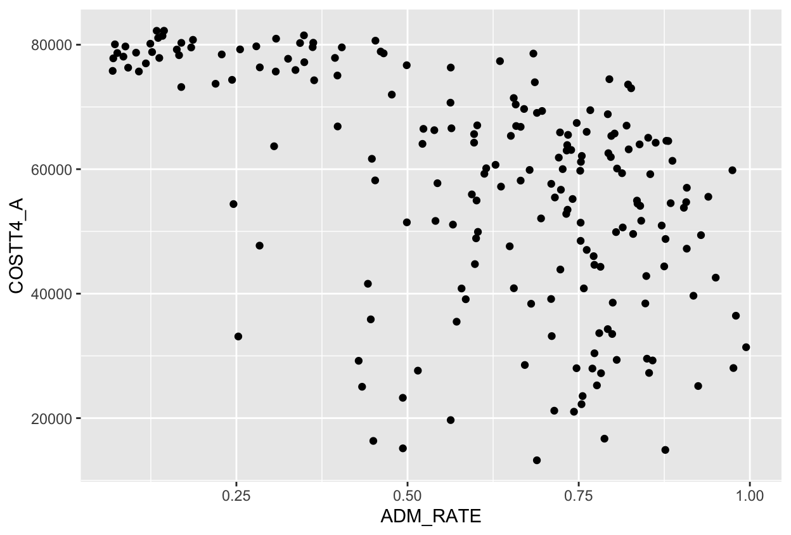

#### Before we starting codings: Bugs

We are going to do some live-coding today but `R` is finicky so be prepared for 🐛s. Check out "data_viz_key.qmd" for the correct code or raise your hand for help.

# Load Packages

The packages we need for our explorations today (`readr` for reading in data and `ggplot2` for graphing data) are part of a popular suite of packages called the `tidyverse`.

```{r}
library(tidyverse)
library(ggrepel)
```

# Data Background

In 2013, the government decided to make data about colleges more accessible so that students and parents could more easily compare schools. These data are called the ["College Scorecard" data](https://collegescorecard.ed.gov/) and the 2024 dataset contains 3,305 variables on 6,484 universities in the US!

I have filtered that 2024 dataset to only include schools which confer majority baccalaureate degrees and where the majority of those degrees are in the arts and sciences based on the Carnegie Classification system. In other words, I filtered the data down to the schools which are "similar" to Bucknell (including Bucknell itself) and picked out some variables for us to explore.

Let's use these data to start exploring and visualizing with `R`!

## Data Dictionary

Below are the code names and descriptions of the variables in our dataset.

-   `UNITID`: Unique identifier

-   `INSTNM`: Name of institution

-   `CITY`: City

-   `STABBR`: State

-   `HIGHDEG`: Highest degree awarded (0 = Non-degree grants, 1 = Certificate degree, 2 = Associate degree, 3 = Bachelor's degree, 4 = Graduate degree)

-   `HIGHDEG_CAT`: Highest degree awarded (Bachelor's degree, Graduate degree)

-   `PREDDEG`: Predominant undergraduate degree awarded (0 = Not classified, 1 = Predominantly certificate-degree granting, 2 = Predominantly associate's-degree granting, 3 = Predominantly bachelor's-degree granting, 4 = Entirely graduate-degree granting)

-   `CONTROL`: Ownership (1 = Public, 2 = Private non-profit, 3 = Private for-profit)

-   `CONTROL_CAT` = Ownership (Public, Private non-profit, Private for-profit)

-   `HBCU`: Flag for Historically Black College and University

-   `TUITFTE`: Net tuition revenue per full-time equivalent student

-   `AVGFACSAL`: Average faculty salary

-   `ADM_RATE`: Admission rate

-   `SATVR75`: 75th percentile of SAT scores at the institution (critical reading)

-   `SATMT75`: 75th percentile of SAT scores at the institution (math)

-   `ACTCM75`: 75th percentile of the ACT cumulative score

-   `COSTT4_A`: The average annual total cost of attendance, including tuition and fees, books and supplies, and living expenses for all full-time, first-time, degree/certificate-seeking undergraduates who receive Title IV aid.

-   `NPT4_PRIV`: The average annual total cost of attendance (CostT4_A, CostT4_P), including tuition and fees, books and supplies, and living expenses, minus the average grant/scholarship aid

-   `UGDS`: Enrollment of undergraduate certificate/degree-seeking students

-   `UG25ABV`: Percentage of undergraduates aged 25 and above

-   `PCTFLOAN_DCS`: Percentage of degree/certificate-seeking undergraduate students awarded a federal loan

-   `PCTPELL_DCS`: Percentage of degree/certificate-seeking undergraduate students awarded a Pell Grant

-   `DEBT_MDN`: The median original amount of the loan principal upon entering repayment

-   `C100_4`: Completion rate for first-time, full-time students at four-year institutions (100% of expected time to completion)

-   `RET_FT4`: First-time, full-time student retention rate at four-year institutions

-   `MD_EARN_WNE_5YR`: Median earnings of graduates working and not enrolled 5 years after completing

-   `Location`: Whether or not the institution is located in Pennsylvania or not

# Load the Data

Run the following code to load and inspect the data.

```{r}
# Load the data
colleges <- read_csv("data/ccbasic21.csv") 


# Wrangling data (will discuss next time!)
colleges <- colleges %>%
  mutate(Location = if_else(STABBR == "PA", "PA", "Not PA"),
         CONTROL_CAT = case_match(CONTROL, 
                                  1 ~ "Public",
                                  2 ~ "Private non-profit"),
         HIGHDEG_CAT = case_match(HIGHDEG,
                                  3 ~ "Bachelor's degree",
                                  4 ~ "Graduate degree"))
  

# Inspect the data
glimpse(colleges)
```

-   How many institutions are in the dataset?
-   How many variables are in in the dataset?
-   Verify that Bucknell is in our dataset. (Hint: Click on the dataset name in the Environment tab to pull up a snapshot of the data.)

# First `ggplot`!

Let's now learn to create graphs with the package `ggplot2`.

**Guiding Principle**: We will map variables from the **data** to the **aes**thetic attributes (e.g. location, size, shape, color) of **geom**etric objects (e.g. points, lines, bars).

```{r}
#| eval: false

ggplot(data = ---, mapping = aes(---)) +
  geom_---(---) 
```

## Scatterplot

Let's walk through how to re-create the following graph that compares the admission rate (`ADM_RATE`) and total yearly cost (`COSTT4_A`).



To fill in the code below, we should ask ourselves the following questions:

-   What is the name of the dataset?
-   What is the geom (shape)?
-   What are the variables?
-   How should we map the variables to the geom?

```{r}
#| eval: false

ggplot(data = ---, mapping = aes(---)) +
  geom_---(---) 
```

Make sure to remove the `#| eval: false` before rendering the document so that the graph appears in the output.

Describe the relationship between these two variables.

## Labels!

We can use the `labs()` layer to add context and fix our axis labels.

```{r}
#| eval: false

ggplot(data = ---, mapping = aes(---)) +
  geom_---(---) +
  labs(---)
```

## Setting versus Mapping

We can change the look of our graph by **setting** the value of some of the aesthetics. Let's learn how to do the following:

-   Make the points somewhat transparent.
-   Make the points bigger.
-   Color the points by your favorite color. (Let's talk about `colors()`!)

```{r}

```

This is called **setting** because we applied the same treatment to all points (e.g., now all of the points are your favorite color).

We would say that we **mapped** `ADM_RATE` to the x-axis and `COSTT4_A` to the y-axis because we used a variable in the dataset to determine the value of these aesthetics.

Let's change our graph so that instead of **setting** the color we **map** `Location` to color.

```{r}

```

If we want to pick better colors than salmon and teal, we need to learn about the `scale_()` layer.

```{r}

```

## Trends

We can add other `geom`'s to our graph. In particular, I'd like to add a `geom` that captures the general trend between the variables.

```{r}

```

Do lines seem to capture the general trend in the variables?

## Where is Bucknell?

The following code creates a dataset with only Bucknell's info. (We will learn more about the `filter()` function next time!)

```{r}
Bucknell <- filter(colleges, INSTNM == "Bucknell University")
```

Let's annotate our graph to label Bucknell.

```{r}


```

# Moving Beyond the Scatterplot

## `geom_histogram()`

Let's create a histogram of `ADM_RATE`. Let's also

-   Play around with the number of bins.
-   Make the bars and outline of the bars fun colors!

```{r}

```

## `geom_boxplot()`

Let's create boxplots of `ADM_RATE` by whether or not a school is private or public (`CONTROL`).

```{r}

# Or recode CONTROL

```

Let's add `HIGHDEG_CAT` to our boxplots by coloring the boxes based on the categories of `HIGHDEG_CAT.`

```{r}

```

## `geom_violin()`

Let's now create violin plots of `ADM_RATE` by whether or not a school is private or public (`CONTROL`).

```{r}


# Add the data points to the plot (with jitter)

```

Compare and contrast the information provided by the boxplot and the violin plot.

## `geom_bar()`

Let's create bar graphs that compare the number of public and private schools by highest degree awarded.

```{r}
# Graph of counts


# Graph of dodged counts


# Graph of proportions
       
```

# `fill` versus `color`

Here's a graph where we used `scale_color_manual()`:

```{r}
ggplot(data = colleges,
       mapping = aes(x = ADM_RATE, 
                     y = COSTT4_A,
                     color = Location)) +
  geom_point(size = 2, alpha = .5) +
  scale_color_manual(values = c("slateblue", "orange"))
```

Let's try to change the colors in our bar plot:

```{r}

```

Look in your `aes()` and see if you are using `color` or `fill` before deciding the `scale_XXX()`.

# Resources for Learning More about Graphing with `ggplot2`

-   Modern Dive's chapter on [Data Visualization](https://moderndive.com/2-viz.html)
-   R for Data Science's chapter on [Data Visualization](https://r4ds.had.co.nz/data-visualisation.html)
-   `ggplot2` cheatsheet: <https://rstudio.github.io/cheatsheets/data-visualization.pdf>
