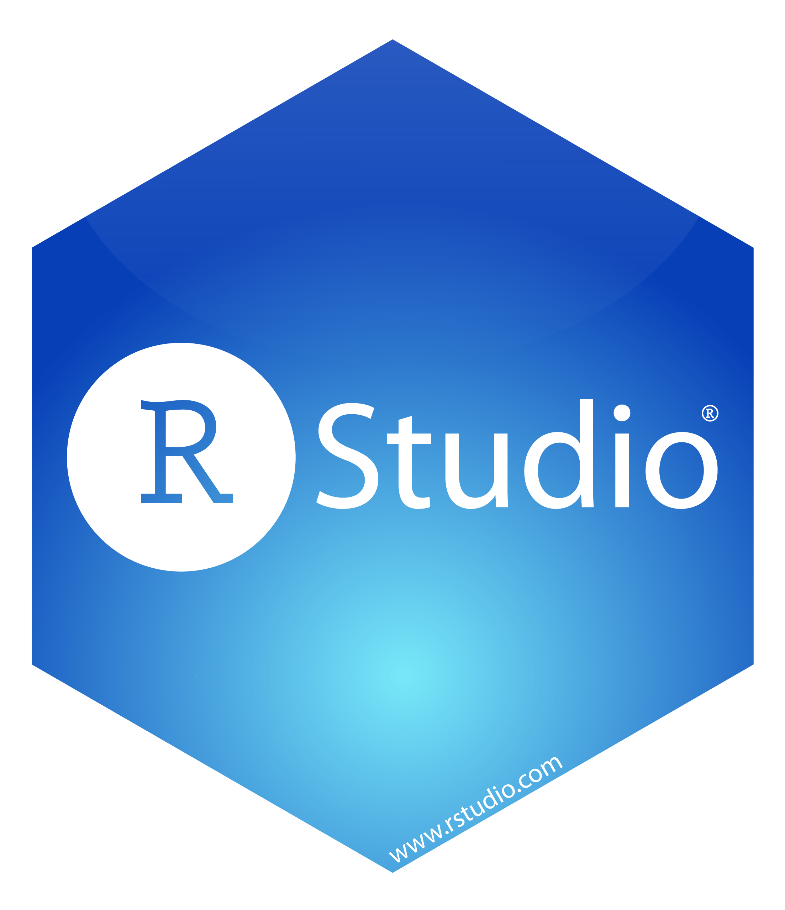
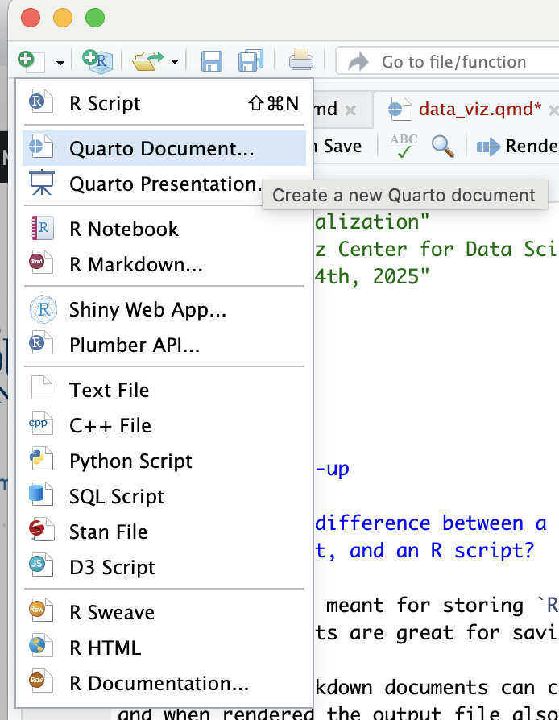

# R and RStudio

{width="20%"}

`R` is the name of the programming language.

{width="20%"}

`RStudio` is a pretty interface for interacting with `R`.  We are currently using an online version that is hosted on a Posit Cloud Server.

For understanding the difference between `R` and `RStudio`, think of `R` as the engine of the car and `RStudio` as the car's dashboard.

## Local Installation vs Posit Cloud

I have invited you all to a Posit Cloud Workspace.  This is where I will post the materials for the workshop.  You will be able to clone and modify the materials here, which is a good way to engage with `R` when you are starting out.  

Before the end of the week, I'd recommend downloading `R` and RStudio to your personal computer.  You can find directions [here](https://posit.co/download/rstudio-desktop/).  If you decide to work locally during the workshop series, make sure to export the files that I post to Posit Cloud. 


## Main Components of RStudio Lay-Out

**Console**

-   Sideways caret called **prompt**.

-   Where you run code.

-   Let's try it:

```{r}
6 * 2/ 3
```


**Environment**

-   Lists items stored in your session.

-   Will add some items soon!

**Files et. al.**

-   **Files**: Accesses files in that project.

-   **Plots**: Contains graphs we create.

-   **Packages**: Installs and loads packages.

-   **Help**: Displays help files.

# Quarto

{width="20%"}

Quarto is an open-source tool for storing and writing about our data work.

-   Why are we using Quarto (instead of Word, Google Docs, Overleaf, etc)?
    -   You can put all your work (code, output, and write-up) in one document which allows for a fully reproducible workflow.
    -   When you render the Quarto file, you get a slick output document. Some of the output options include PDF, HTML, and MS Word.
    -   You can insert math symbols (with what is called Latex code): $\mu$.
-   When editing a Quarto document, you can choose between the Source editor or the Visual editor. We recommend testing out both.
    -   **Source editor**: Shows the raw markdown syntax when editing.
    -   **Visual editor**: Provides a word processor type interface when editing.

## R code and output

To include `R` code and output, you need to create an `R` **chunk**. Here's an example `R` chunk:

```{r}
2 + 2
```

-   The icons in the upper right-hand corner of an `R` chunk are helpful for running the code in your document.
    -   The gray arrow with a horizontal green line tells `R` to run all the chunks above the current chunk.
        -   If you click on the button above, nothing happens as this is our first `R` chunk of the document.
    -   The green arrow tells `R` to run all the code in the current chunk.
        -   Notice what happens when you click on this button.
-   Other options for running code in an `R` chunk include:
    -   Put the cursor on the same line as the code and hit Command+Enter (for a Mac) and Control+Enter (for Windows).
    -   Put the cursor on the same line as the code and hit the "Run" button.
-   You can insert an `R` **chunk** into the document by clicking on the green button with a plus sign and C in the panel at the top of the document or with the shortcut: Command+Alt+i (on Macs) and Control+Alt+i (on Windows).

## R packages

-   **Useful definition**: People refer to the `R` session that loads without any add-ons as **base R**.

-   Base `R` contains lots of useful commands to analyze data. However, people have developed new commands which are not packaged in this standard version of the program. Therefore, people create **packages** which contain these new commands.

-   Whenever we want to use the commands from a package, we need to load the package.

-   Below is the code that loads the `detectors` package in your Quarto document. You will need to run the code (as described above) if you want `detectors` to be loaded in your RStudio Session.

```{r}
library(detectors)
```

-   Go to the **Packages** tab in the lower right. Notice that `detectors` is listed and if you ran the code above, then it is loaded so the box next to `detectors` should be checked.

-   You may want to use a package that is not listed in the Packages Tab. In this case, you will need to install it first, which can be done using the "Install" button (if the package is shared via the Comprehensive R Archival Network).

-   We have pre-installed on the server most of the packages you will use this semester.

-   You only need to install a package once but you need to load a package (using the `library()` function) every time you want to use the commands in the package.

## Rendering

Clicking the **Render** button tells `R` that you want to compile the contents of the Quarto document into an output document.

-   Find the **Render** button and click it. You may get a message to install some `R` packages. Allow it. You may also get a message about allowing popups. Allow them.

-   Examine the output file. This file is saved in the same directory as your Quarto (qmd) file but with a different extension (pdf).

## Workflow

It can take some time to understand the workflow for interacting with `R` and Quarto documents. That is okay! We recommend the following workflow:

-   Make changes to the Quarto document.

-   If the changes involve new `R` code, then run the code (using one of the options described above) to make sure the code behaves how you are expecting. Keep iterating until you are happy with the code.

-   Render the document.

-   Look over the output document.

    -   Is the code displaying how you want?

    -   Does the expected output (graphs, tables, etc) appear?

    -   Does the output look correct?

-   If the output document looks good, start back at the top and make new changes. If not, go back to your code and problem-solve.

# Help!

Learning `R` is tough but worthwhile.  Within `R`, you can also look at the help file for a function by typing `?function_name` into the console.  These help files can take a bit of practice to read and understand.

For more support and community, consider 

* Attending the weekly **Writing/Coding Sessions**: 2:00 - 4:00pm on Mondays in June & July, Taylor Hall 203.
* [Joining rugB](https://datascience.scholar.bucknell.edu/communities-of-practice/).  Sign up [here](https://docs.google.com/forms/d/e/1FAIpQLSepsHlxP5GygXHkgFYK9YbyqdC1ahgcCp3PBzmTqgwD-ZzK_w/viewform).


# Common Questions

#### What is the difference between a Quarto document, an RMarkdown document, and an R script?

-   `R` scripts are meant for storing `R` code (and maybe comments). Scripts are great for saving code.

-   Quarto and RMarkdown documents can contain `R` code and text and when rendered the output file also include output from the code (e.g., tables, graphs). Quarto and RMarkdown are great for archiving all your work.

-   Quarto is the successor to RMarkdown.

#### How do I create a new Quarto document?

{fig-align="center" width="300"}

#### Do spaces and indentation matter for `R` code?

Not for how the code is run. But spaces and indentation will be very important for readability.

```{r}
x<-5
x+2

x <- 5
x + 2
```


# Magic

Run the following `R` chunk to get a sense of the beautiful data work that is in your future:

```{r}
# Load the necessary packages
library(detectors)
library(tidyverse)

# Wrangle data
humans_only <- detectors %>%
  drop_na(native)

# Graph data
ggplot(data = humans_only, mapping = aes(x = native,
                                         fill = .pred_class)) +
  geom_bar(position = "fill") +
  facet_wrap(~detector) +
  labs(x = "Is English one of the native languages of the writer?",
       y = "Proportion of classifications",
       fill = "Prediction") + 
  scale_fill_manual(values = c("cornflowerblue", "purple4"))

```

Notice the similarities and differences of how the code and output are displayed in this (the quarto) document and the output (pdf) document.

**Welcome to the world of** `R` **and reproducible data work!**
